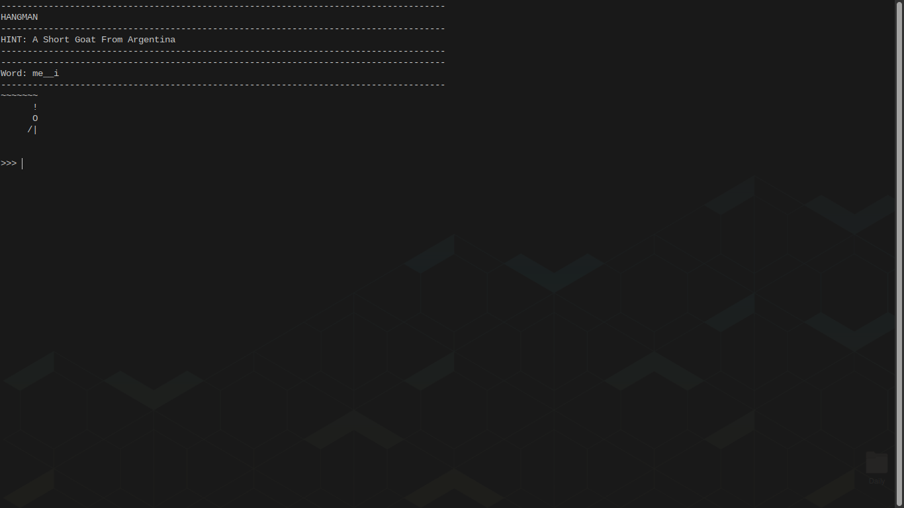

# Hangman

A simple console based game in c programming language.

## Preview

----
## A Short Story

I have always wondered how a computer was built from scratch, just pure maths to a device with boxes and texts. I know I wouldn't feel as smart as every one of those legends who made it possible for me to share this today, in other words those who provided a means to make the world a global village.

But, one thing I know for sure, is that I would try my best to make something life changing from what they have provided me/us with.

#### Requirements

- C/C++ Compiler

#### Installation Steps

Clone repo

> git clone github.com/somtodev/hangman

Move to directory

> cd hangman

Run Commands

> make hangman
> or
> gcc hangman.c -o hangman

then

> ./hangman

##### Contribution

As of now, I am a noobie programmer who just scratch a gaint's pot with a fingertip. Feel free to contribute to this :)
